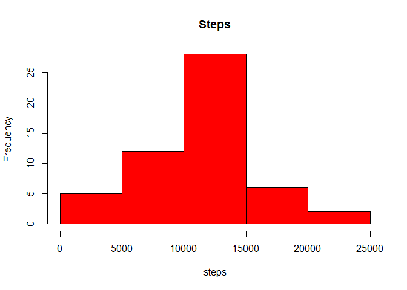
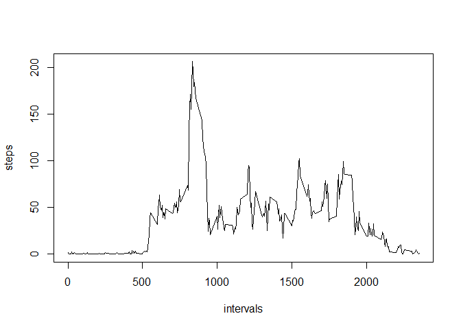
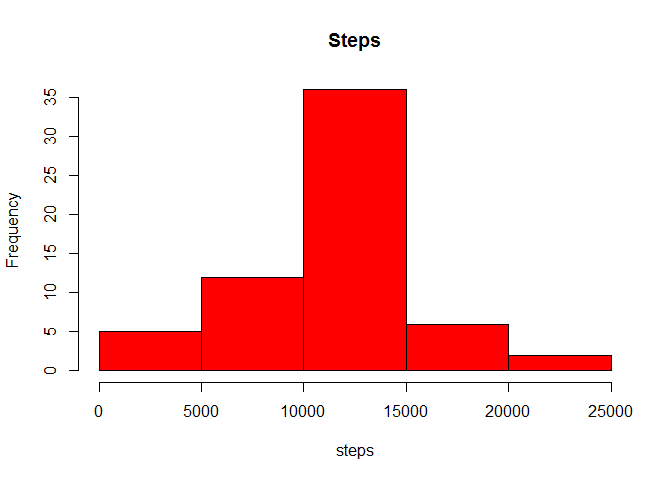
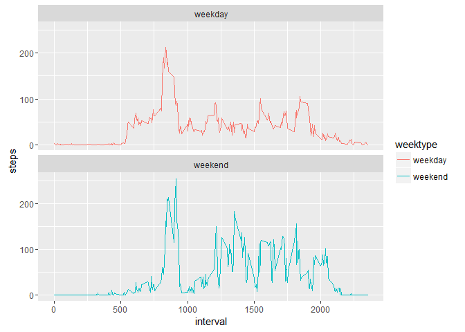

# Reproducible Research: Peer Assessment 1


## Loading and preprocessing the data
#### The following code is used to load the activity data into r :

```r
library(dplyr);library(ggplot2)

if(!file.exists("activity.csv")){
        temp<-tempfile()
        download.file("https://d396qusza40orc.cloudfront.net/repdata%2Fdata%2Factivity.zip",temp)
        x<-unzip(temp)
        x<-read.csv(x,header=T)
        unlink(temp)
        
}else {x<-read.csv("activity.csv",header=T)}
```


## What is mean total number of steps taken per day?

```r
tnarm<-x[(!is.na(x$steps)),]
tnarm$steps<-as.numeric(tnarm$steps)
tnarm$interval<-as.numeric(tnarm$interval)


tnarm$steps<-as.numeric(tnarm$steps)
tnarm$interval<-as.numeric(tnarm$interval)
tnarm<-group_by(tnarm, date=as.Date(tnarm$date))
smstep<-summarise(tnarm,steps=sum(steps))
```
#### The dataframe of the sum of steps for each day excluding missing values:

```r
head(smstep)
```

```
## Source: local data frame [6 x 2]
## 
##         date steps
##       (date) (dbl)
## 1 2012-10-02   126
## 2 2012-10-03 11352
## 3 2012-10-04 12116
## 4 2012-10-05 13294
## 5 2012-10-06 15420
## 6 2012-10-07 11015
```
#### Histogram of the sum of steps:

```r
hist(smstep$steps,col="red",xlab="steps",main="Steps")
```



#### Mean of the sum of steps:

```r
mean_sum<-mean(smstep$steps)
mean_sum
```

```
## [1] 10766.19
```
#### Median of the sum of steps:

```r
median_sum<-median(smstep$steps)
median_sum
```

```
## [1] 10765
```


## What is the average daily activity pattern?

```r
intervals<-x[(!is.na(x$steps)),]
intervals<-group_by(intervals, interval=as.factor(intervals$interval))
mstep<-summarise(intervals,steps=mean(steps))
mstep$interval<-as.numeric(as.character(mstep$interval))
```
#### Dataframe of the mean number of steps for each 5 min interval:

```r
head(mstep)
```

```
## Source: local data frame [6 x 2]
## 
##   interval     steps
##      (dbl)     (dbl)
## 1        0 1.7169811
## 2        5 0.3396226
## 3       10 0.1320755
## 4       15 0.1509434
## 5       20 0.0754717
## 6       25 2.0943396
```

#### Plot of the mean steps taken per 5 min interval:

```r
plot(mstep$interval,mstep$steps,xlab="intervals",ylab="steps",type = "l")
```



#### The 5 min interval with the maximum mean number of steps taken:

```r
intervalmax<-mstep[which.max(mstep$steps),]
intervalmax
```

```
## Source: local data frame [1 x 2]
## 
##   interval    steps
##      (dbl)    (dbl)
## 1      835 206.1698
```


## Imputing missing values
#### Input the average steps per interval for missing step values 

```r
fulldata<-x
s<-(is.na(x$steps))
nonas<-x[!(is.na(x$steps)),]
intav<-tapply(nonas$steps,nonas$interval,FUN = mean)
fulldata$steps[s]<-intav[as.character(x$interval[s])]

fulldata$steps<-as.numeric(fulldata$steps)
fulldata$interval<-as.numeric(fulldata$interval)
groupfulldata<-group_by(fulldata, date=as.Date(fulldata$date))
fullsmstep<-summarise(groupfulldata,steps=sum(steps))
```
#### Dataframe of the steps per interval with missing step values replaced with interval averages:

```r
head(fulldata)
```

```
##       steps       date interval
## 1 1.7169811 2012-10-01        0
## 2 0.3396226 2012-10-01        5
## 3 0.1320755 2012-10-01       10
## 4 0.1509434 2012-10-01       15
## 5 0.0754717 2012-10-01       20
## 6 2.0943396 2012-10-01       25
```


#### Dataframe of the sum of steps for each day with missing step values replaced with interval averages: 

```r
head(fullsmstep)
```

```
## Source: local data frame [6 x 2]
## 
##         date    steps
##       (date)    (dbl)
## 1 2012-10-01 10766.19
## 2 2012-10-02   126.00
## 3 2012-10-03 11352.00
## 4 2012-10-04 12116.00
## 5 2012-10-05 13294.00
## 6 2012-10-06 15420.00
```
#### Total number of missing values:


```r
sum(s)
```

```
## [1] 2304
```
#### Histogram of the sum of the number of steps with the missing step values replaced with the interval average:

```r
hist(fullsmstep$steps,col="red",xlab="steps",main="Steps")
```



#### Mean of the sum of steps with missing step values replaced with interval averages:

```r
fullmean_sum<-mean(fullsmstep$steps)
fullmean_sum
```

```
## [1] 10766.19
```
#### Median of the sum of steps with missing step values replaced with interval averages:

```r
fullmedian_sum<-median(fullsmstep$steps)
fullmedian_sum
```

```
## [1] 10766.19
```

#### The mean and median for the completed sum of steps are the same as the incomplete version

## Are there differences in activity patterns between weekdays and weekends?

```r
weektypes<-fulldata
weektypes<-mutate(weektypes,weektype=ifelse(weekdays(as.Date(weektypes$date))=="Saturday"|weekdays(as.Date(weektypes$date))=="Sundays",
yes = "weekend",no = "weekday"))

weektypes$weektype<-as.factor(weektypes$weektype)
weektypes$interval<-as.factor(weektypes$interval)
c<-group_by(weektypes,interval,weektype)
average<-summarise(c,steps=mean(steps))
average$interval<-as.numeric(as.character(average$interval))
gplot <- ggplot(average, aes(x=interval, y=steps, color = weektype)) +
        geom_line() +
        facet_wrap(~weektype, ncol = 1, nrow=2)
```
#### Full Activity Data Set with extra variable identifying week types:

```r
head(weektypes)
```

```
##       steps       date interval weektype
## 1 1.7169811 2012-10-01        0  weekday
## 2 0.3396226 2012-10-01        5  weekday
## 3 0.1320755 2012-10-01       10  weekday
## 4 0.1509434 2012-10-01       15  weekday
## 5 0.0754717 2012-10-01       20  weekday
## 6 2.0943396 2012-10-01       25  weekday
```
#### Dataframe of the average steps per 5 min interval, seperated into weektypes, using the full activity data set:

```r
head(average)
```

```
## Source: local data frame [6 x 3]
## Groups: interval [3]
## 
##   interval weektype      steps
##      (dbl)   (fctr)      (dbl)
## 1        0  weekday 1.94375222
## 2        0  weekend 0.21462264
## 3        5  weekday 0.38447846
## 4        5  weekend 0.04245283
## 5       10  weekday 0.14951940
## 6       10  weekend 0.01650943
```
#### Panel Plot of the average steps per 5 min interval for weekdays and weekends:

```r
print(gplot)
```



#### As one can observe from the above plots, the average steps for weekdays are higher for the earlier part of the day and lower throughout the rest of the day. On the otherhand, average steps taken for weekends are consistently higher throughout the day. Such observations are indicative of the subjects daily patterns, such that subjects are expected to be working on weekdays, typically in a sedentery position, possibly exercising before work. During weekends the subjects are not working and therefore more active throughout the day.

